# omaRSYNC

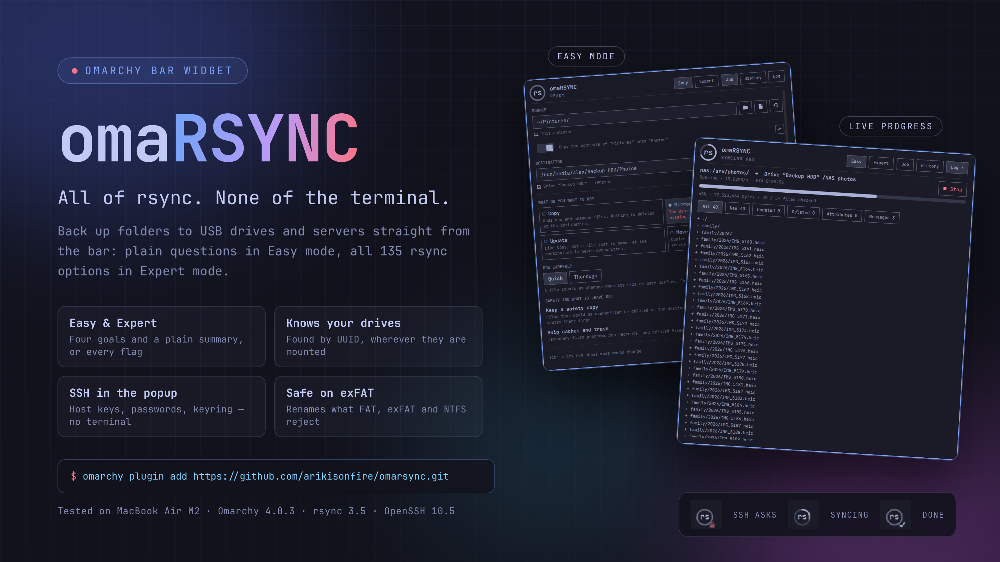

**rsync in your Omarchy bar.** Back up folders to a USB drive or a server without
opening a terminal: Easy mode asks four plain questions, Expert mode gives you all
135 rsync options, filters and the exact command line.

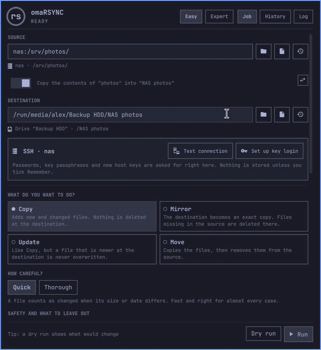

*Answering a server's host-key and password questions in the popup, then syncing.
[Watch it in full quality (MP4)](docs/ssh-sync.mp4)*

## Why

rsync is the right tool for backups, and it is also the one where a typo in
`--delete` costs you an afternoon. omaRSYNC keeps rsync in charge and takes care of
the parts that are easy to get wrong: it knows which drive is plugged in, refuses
runs that would empty your home folder, answers SSH questions in the popup instead
of a terminal, and shows you the command it is about to run.

## Features

### Easy mode

| Goals and questions | What will happen |
| --- | --- |
| 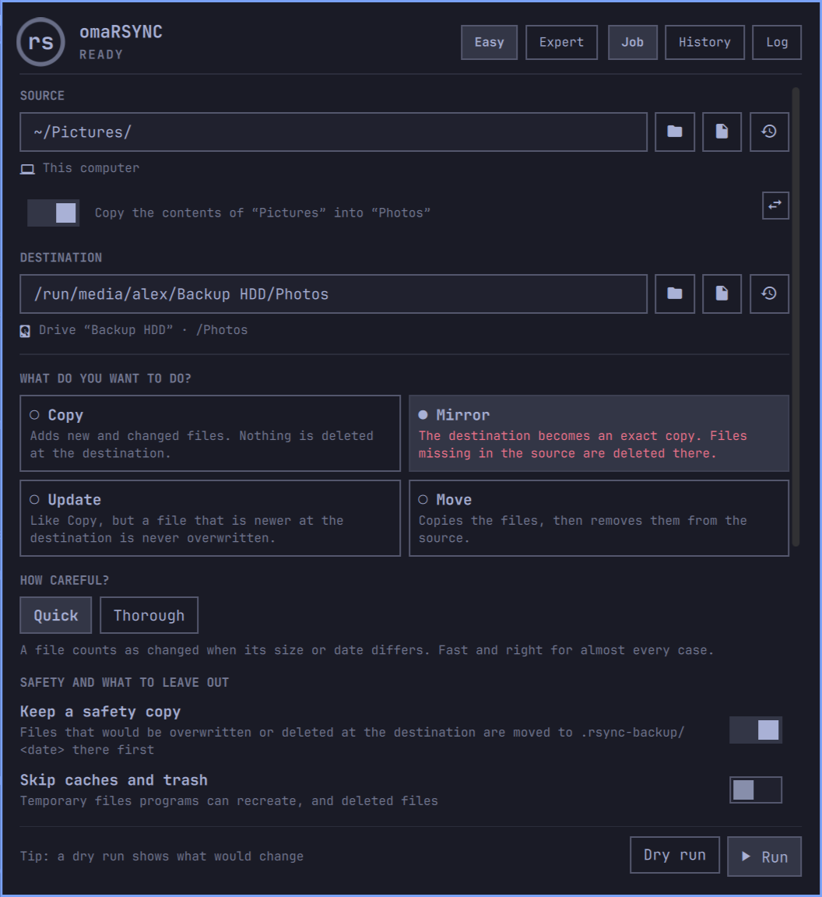 | 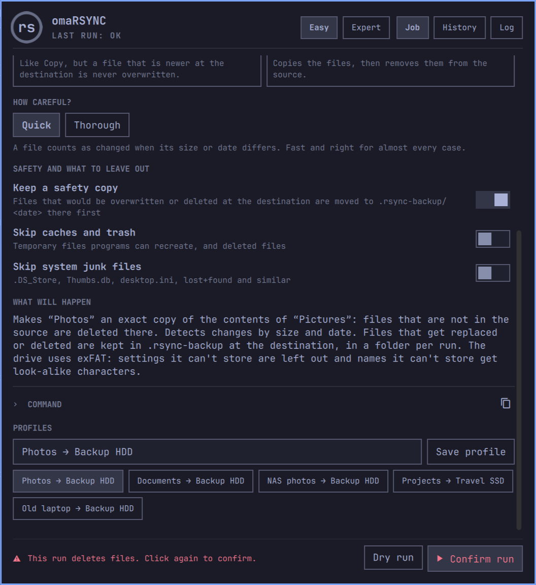 |

- **Four goals:** Copy, Mirror, Update, Move. Mirror and Move say in red what they
  delete.
- **How careful:** Quick compares size and date, Thorough compares checksums.
- **Safety and what to leave out:** keep a safety copy (replaced and deleted files
  are moved to `.rsync-backup/<date>` first), skip caches and trash, skip system
  junk files.
- **Connection** (server jobs only): slow connection, resume interrupted files, and
  a speed limit.
- **What will happen:** the whole job in one plain paragraph, before anything runs.
- Easy mode keeps no settings of its own. It reads the same job Expert mode edits,
  so you can switch at any time.

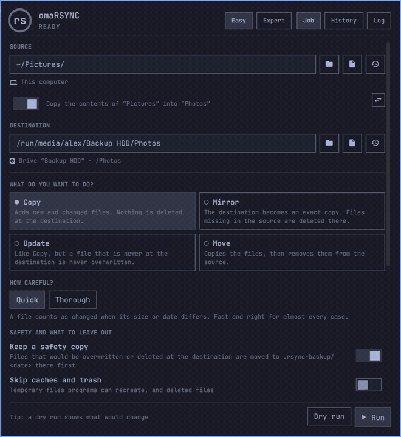

### Expert mode

| The job | The option catalog |
| --- | --- |
| 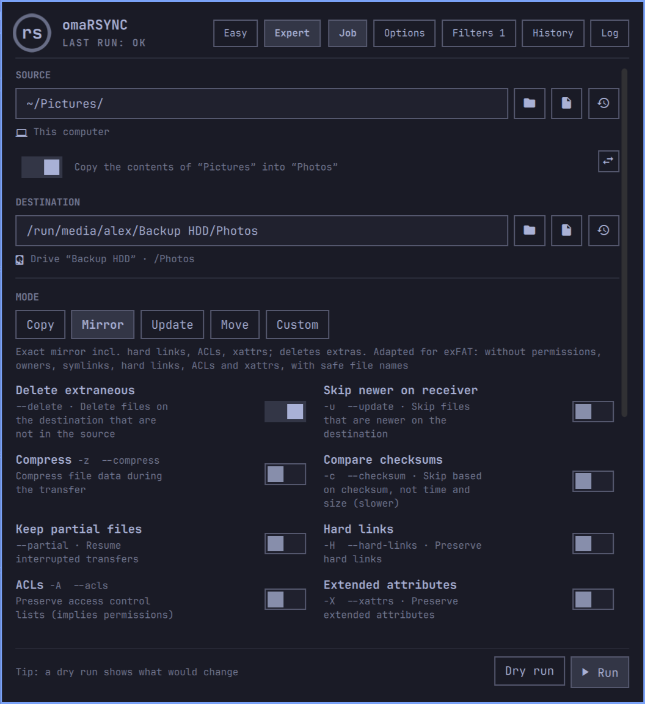 | 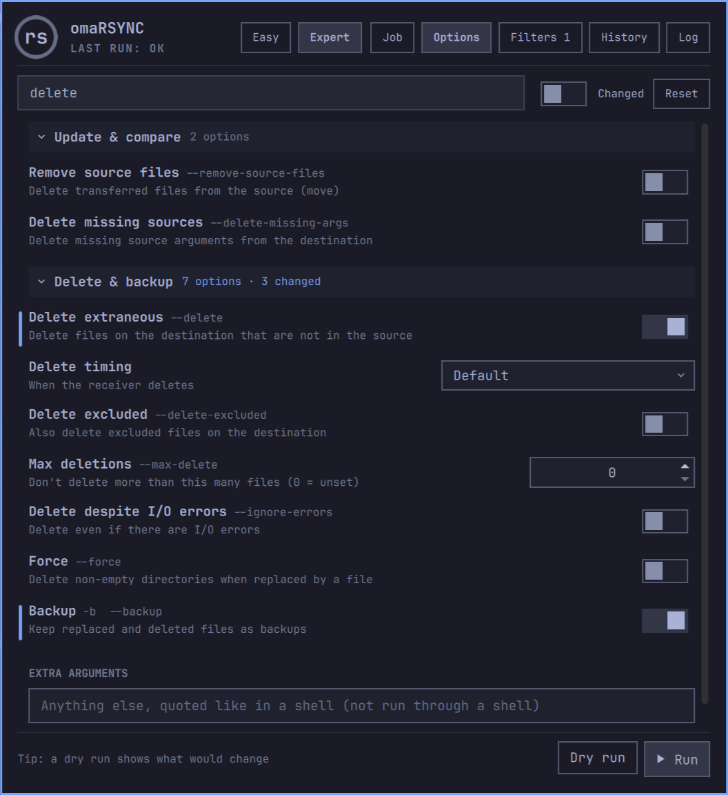 |

- **Presets** (Copy, Mirror, Update, Move) plus quick switches for the options you
  change most, and a bandwidth slider.
- **135 options** in seven groups, searchable by name, flag or description, with a
  *Changed* filter and a Reset button. Options implied by archive mode say so, and
  turning one off emits `--no-…`.
- **Filters tab:** ordered rules (exclude, include, protect, risk, hide, show,
  merge, dir-merge, clear), one-click excludes for `.git/`, `node_modules/`,
  `.cache/`, `*.tmp` and friends.
- **Extra arguments** are split with shell-style quoting and passed to rsync
  directly. Nothing is run through a shell.
- **The command preview** shows exactly what will run, and copies to the clipboard.

| Filters | Command preview and profiles |
| --- | --- |
| 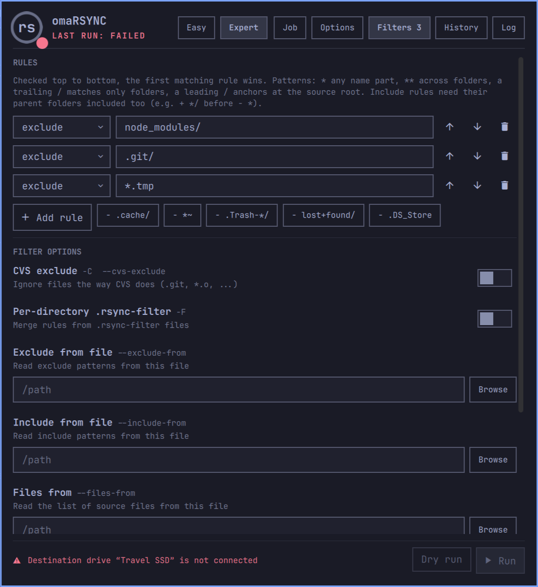 | 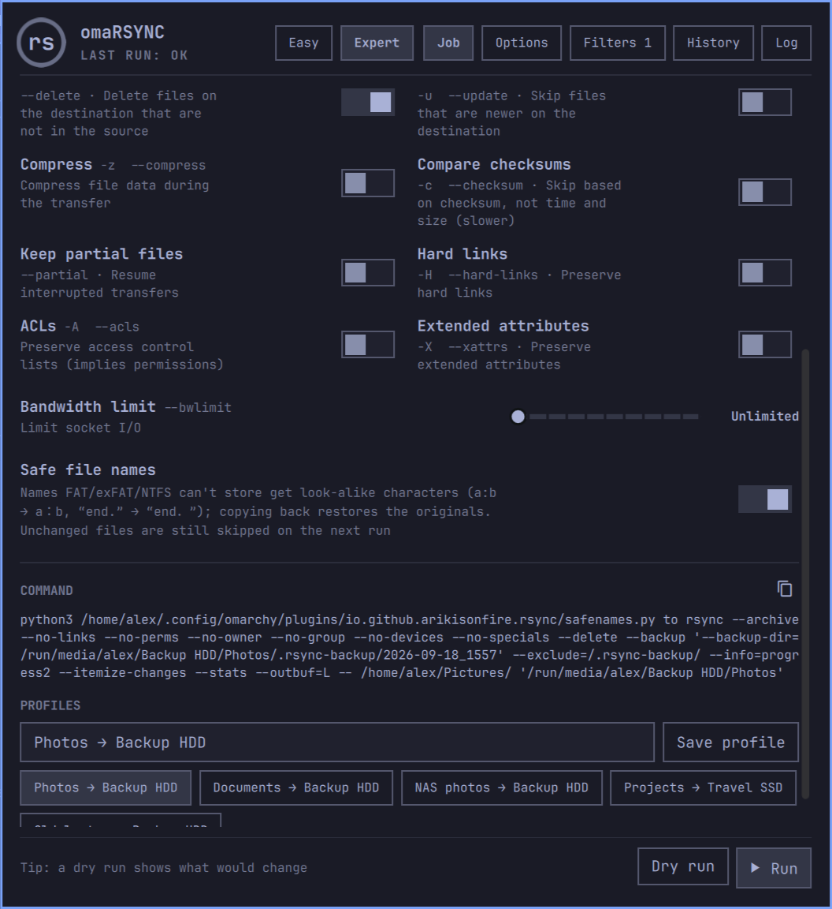 |

### It knows your drives

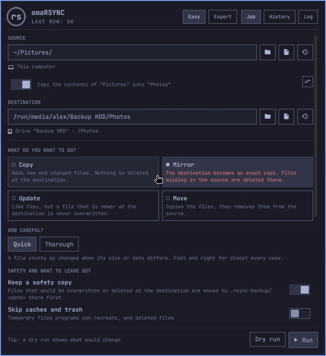

- A path on a removable drive is stored as the drive's **UUID plus a relative
  path**, so the job still works when the drive turns up at another mount point.
- A missing drive is said so in red, and the run buttons stay disabled instead of
  quietly syncing into an empty folder.
- Source and destination fields offer recent locations, connected drives and the
  `Host` entries from your `~/.ssh/config`.

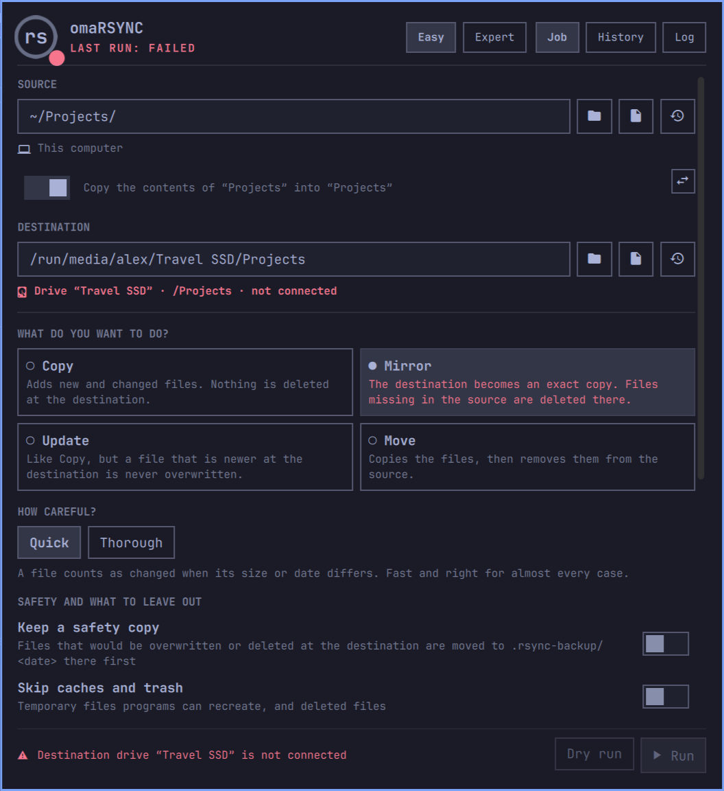

### SSH without a terminal

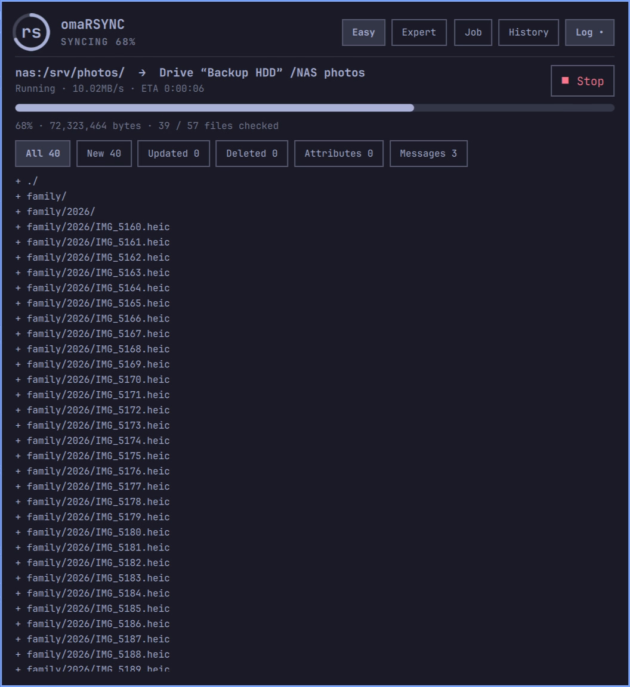

- Host keys, passwords, key passphrases and any other question ssh asks are
  answered **in the popup**. The popup never opens itself for a question, because
  that would take the keyboard focus away from whatever you are typing; you get a
  notification instead.
- **Remember in keyring** stores a password in the `login` keyring (libsecret), and
  only ever for the exact `user@host` that `ssh -G` resolved — never for a jump
  host. A password that stops working is removed again by itself.
- Key passphrases can be remembered too. They are checked against the key file
  before they are stored.
- **Test connection** and **Set up key login** (creates the key when missing, then
  runs `ssh-copy-id`) live next to the job.
- Port, identity file and extra ssh options are in Options › Connection.
  `ProxyJump` and everything else in your `~/.ssh/config` applies as usual.
- rsync daemon paths (`rsync://host/module`, `host::module`) work as well.

### A safety net for the dangerous flags

- A run that deletes on the destination is **refused** when the destination is `/`,
  a system folder, `/run/media/<user>`, your home folder or any folder containing
  it — and the same protection applies to the source of a Move.
- Before such a run, local paths are resolved with `realpath` and checked again, so
  a symlink can't smuggle the job into your home folder. Every mount point is
  checked too: a drive mounted inside the destination is never emptied along with
  it.
- A deleting run needs a **second click** on *Confirm run* within four seconds.
  Editing the job cancels it.
- **Dry run** is always one click away and changes nothing.

### Safe file names on exFAT, FAT32 and NTFS

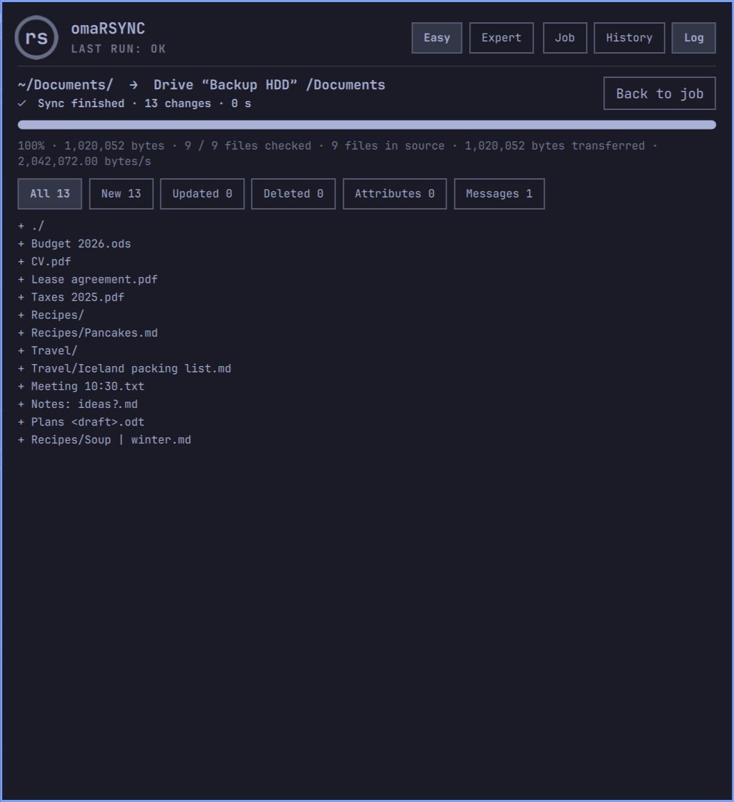

Those file systems reject `\ : * ? " < > |` and names ending in a dot or a space,
and rsync stops with “Invalid argument”. With **Safe file names** those characters
are written as look-alikes (`：？＜＞＂＊｜＼`), copying back restores the originals,
and unchanged files are still skipped on the next run. Easy mode turns this on and
off for you; FAT32 destinations also get `--modify-window=1`, otherwise its 2-second
time stamps make every run copy everything again.

### History and log

| History | Dry run |
| --- | --- |
|  | 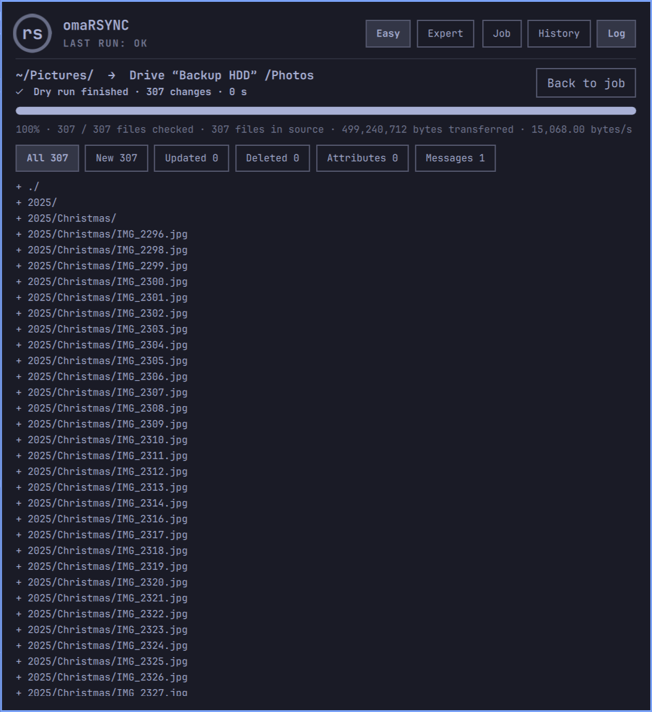 |

- Every run is kept with its result, counts, transferred bytes, duration and the
  command line. **Run again**, **Load**, **Copy command** and **Remove** are one
  click away; a rerun asks for confirmation.
- Passwords in stored command lines and jobs are **redacted** (`sshpass -p`,
  `pass…=`, `scheme://user:pw@`).
- The log shows rsync's itemized changes live, filtered by New, Updated, Deleted,
  Attributes and Messages, with the current rate and an ETA, and a Stop button.

### Bar icon


| The icon shows | Meaning |
| --- | --- |
| Faint ring | Idle |
| Ring filling up | A sync is running; the arc is the progress |
| Circling segment | rsync is still building the file list |
| Pulsing red padlock | ssh is waiting for an answer |
| Small `n` | A dry run is running |
| Check mark | The last run finished (six seconds) |
| Red dot | The last run failed |

A left-click opens the popup, a right-click during a run opens the Log tab, and the
tooltip carries the current percentage, rate and ETA.

### Notifications, keybindings and scripts


Every finished run sends a notification, and so does a question from ssh while the
popup is closed.

Saved profiles can be run from a keybinding, a script or a systemd timer:

```sh
omarchy-shell io.github.arikisonfire.rsync.jobs run "Photos → Backup HDD"
omarchy-shell io.github.arikisonfire.rsync.jobs dryRun "Photos → Backup HDD"
omarchy-shell io.github.arikisonfire.rsync.jobs stop
omarchy-shell io.github.arikisonfire.rsync.jobs status      # idle | running 42% | ok | failed …
omarchy-shell io.github.arikisonfire.rsync.jobs show log    # job | options | filters | history | log
```

In `~/.config/hypr/bindings.lua`:

```lua
o.bind("SUPER + CTRL + R", "Sync photos", 'omarchy-shell io.github.arikisonfire.rsync.jobs run "Photos → Backup HDD"')
```

### Follows your theme

| Tokyo Night | Cirrus Day |
| --- | --- |
|  | 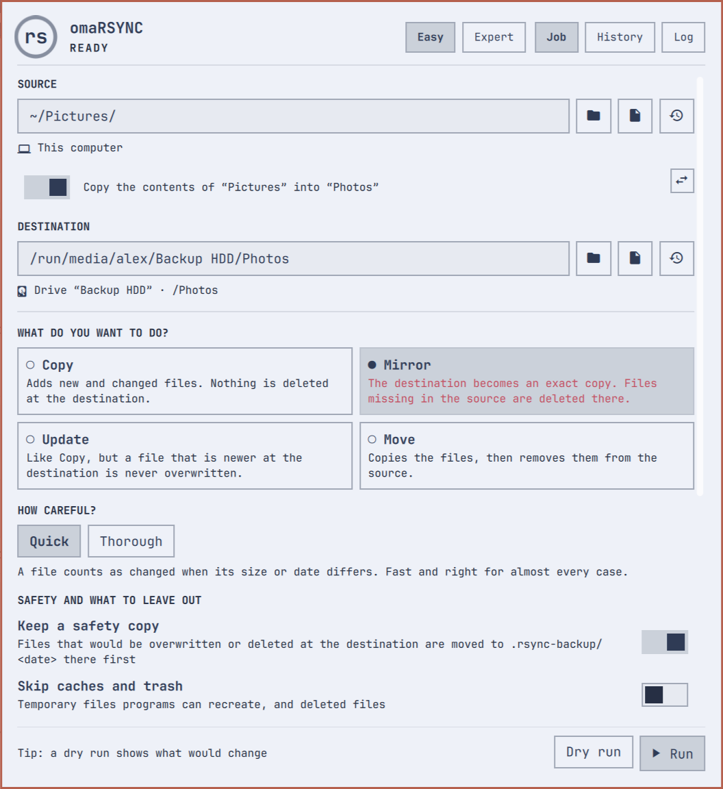 |

## How it was tested

Built and used on an Apple MacBook Air M2 running Omarchy 4.0.3 on Asahi Linux
(aarch64), with rsync 3.5.0 and OpenSSH 10.5p1.

| Scenario | What was covered |
| --- | --- |
| Folder → folder on the laptop | Copy and Mirror, dry runs, filters, the delete guards |
| Laptop → USB hard disk (WD 2 TB, **exFAT**) | Mirror with `--delete`, safety copy, safe file names, drive recognised by UUID, unplugging and plugging back in |
| Linux server (StartOS) over SSH → the same USB disk | Password login answered in the popup, password remembered in the keyring, `Set up key login`, and a key with a passphrase kept in the keyring |
| exFAT image on a loop device | Edge cases of safe file names: look-alike collisions, names differing only in case, names that would become `.` or `..`, deletions with `--max-delete` |

Automated tests, no shell needed:

```sh
node test-options.js   # 22 tests: option catalog, argv, safety guards, parsing, presets
node test-easy.js      #  6 tests: Easy mode questions, answers and summary
```

**Not tested yet**, so reports are welcome: laptop-to-laptop over SSH, uploading to
a server, NTFS and FAT32 drives, rsync daemon (`rsync://`) targets, and x86_64
machines (nothing in the plugin is architecture specific).

## Requirements

| Needs | Comes with Omarchy |
| --- | --- |
| `rsync` 3.1 or newer (3.5 recommended; the option catalog covers current flags) | usually installed; otherwise install the `rsync` package |
| `ssh` from OpenSSH 8.4 or newer, only for server jobs | yes |
| `libsecret` (`secret-tool`) and a keyring such as gnome-keyring, only for *Remember in keyring* | yes |
| `python3`, `python-gobject` and an `xdg-desktop-portal`, for the folder picker and safe file names | yes |
| `wl-clipboard` for *Copy command*, `libnotify` for notifications, `util-linux` for `lsblk` and `findmnt` | yes |

The widget tells you when rsync is missing or too old, and the folder picker says
so when the portal is unavailable. Everything runs as your own user; the plugin
never needs root and never mounts drives itself.

## Install

```sh
omarchy plugin add https://github.com/arikisonfire/omarsync.git --enable
```

The icon appears in the right section of the bar.

## Update

```sh
omarchy plugin update io.github.arikisonfire.rsync
```

## Remove

```sh
omarchy plugin remove io.github.arikisonfire.rsync
```

That leaves your jobs and history behind. To remove those as well:

```sh
rm -rf ~/.config/omarchy-rsync ~/.local/state/omarchy-rsync
secret-tool clear app omarchy-rsync
```

## Settings

In the Omarchy bar settings:

| Setting | Default | Meaning |
| --- | --- | --- |
| `notify` | `true` | Notify when a sync finishes or needs input |
| `defaultRsh` | `ssh` | The ssh command used for the SSH options, Test connection and key setup |
| `historyLimit` | `200` | Runs kept in history (10 to 1000) |

## Where your data lives

| What | Where |
| --- | --- |
| Jobs, profiles, Easy/Expert mode | `~/.config/omarchy-rsync/state.json` |
| Run history | `~/.local/state/omarchy-rsync/history.json` |
| Passwords and key passphrases | your `login` keyring, never a file of ours |
| SSH questions while a run is going on | FIFOs in a `0700` directory under `$XDG_RUNTIME_DIR` |

Both files are kept in `0700` directories and set to `0600`, because paths, host
names and profiles are private. Secrets travel over stdin and those FIFOs only,
never in a command line, an environment variable or a log. The control messages
between ssh and the popup carry a random token that is never exported, so no remote
host can fake a question.

Command lines and jobs in the **history** are redacted, but a job you save as a
profile is stored as you typed it. If you put a password into Extra arguments, it
stays there in plain text — the keyring is the safe place for it, and the command
preview warns you.

The plugin talks to nothing but the rsync and ssh processes it starts.

## License

MIT. See [LICENSE](LICENSE).
